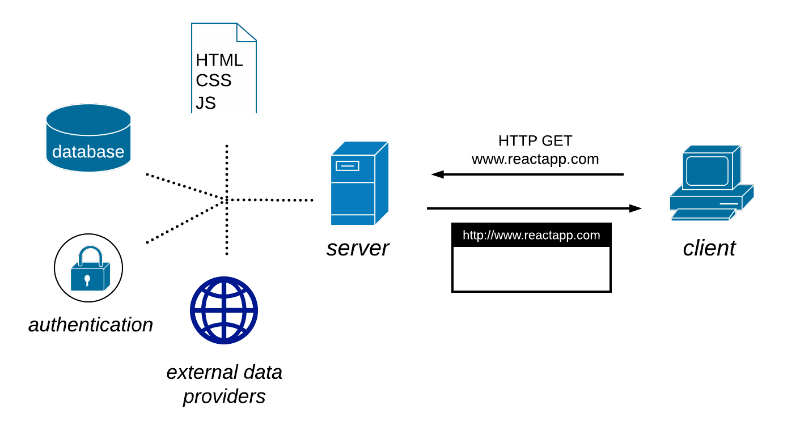
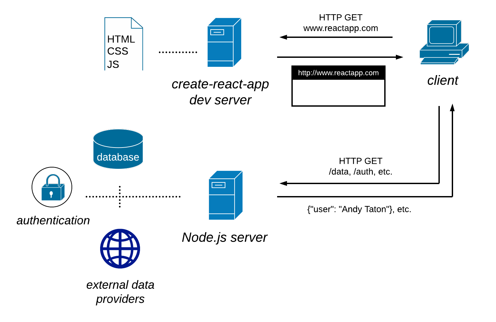

# `full-stack-basic`

The second full demonstration project connects a React front end to a Node.js back end server. It also takes advantage of `create-react-app`, a build tool developed by Facebook to simplify the process of initiating and maintaining a React project.

# Simultaneous Client-Server Development with Create-React-App

Create-React-App (CRA) is a powerful tool for the React developer. By taking responsibility for keeping babel and webpack configurations up-to-date, and by providing a hot-reloading development server, debugger, and testing environment out of the box, CRA helps developers focus on creating their website, without getting mired in the details of setting up their development environment. But CRA only scaffolds the front end of a website; by design, CRA does not provide any framework for back-end development. In fact, the development server that comes with CRA and that helps so much with working on the front end can actually get in the way of simultaneously creating a back-end server.

But it is possible, even straightforward, to develop a local Node.js server in concert with CRA. The goal of this repository is to walk you through setting up a simple Node/Express/React project with `create-react-app`. Although you might be able to clone and install this repo as a stub for your own projects, I actually think it is easier to set the project up from scratch yourself. This repo will show you how.

By the end of this project tutorial (described over two branches of this repo), we will have created a Heroku-hosted Node.js server that connects to a database, retrieves live data from external sources, and serves that data within a React app.

## Our Target: Two Development Servers that Mimic One Production Server

In _production_ (and also during _staging_, a local test of the production build), our simple React app will be served by a single server that does everything—delivers web files, responds to REST HTTP requests, and connects users to third-party services like authentication or data:

<p align="center">
  
</p>

However, during _development_, we'd like to take advantage of create-react-app's development server/debugger to serve React files, while still having our own server to provide other services. Towards this end, our project's target development configuration will look like this:

<p align="center">
  
</p>

## Getting started

You will be setting up a create-react-app (client) project _inside_ a Node.js (server) project. You will need Node.js v6 or greater installed to use CRA.

* In a newly created project folder,
    ```
    > npm init
    ```
    (or `yarn init` if you use `yarn`) to initialize the server project. In the project startup dialog, I named my entry point `server.js`; my description below will use that root filename, but feel free to name it whatever you like. Create that root file:
    ```
    > touch server.js
    ```
    
* Edit `package.json` to contain a start script:

    ```
    "scripts": {"start": "node server.js"}
    ```

* Create a `/server` subfolder to keep all of the Node.js code that supports `server.js`. Don't put anything in there yet; we won't be using this folder until the next branch.

* Feel free to set up version control in the project folder. 

    ```
    > git init
    > git add .
    > git commit -m "Initial commit."
    ```

* Still in the parent project folder, initiate a new CRA project named `client`:

    ```
    > npx create-react-app client
    ```
    to tie a local installation of CRA to your app, or

    ```
    > create-react-app client
    ```

    if you've previously installed CRA globally on your machine.

* Test to make sure CRA installed the client project by running its start script from the client folder:
    ```
    /client: > npm start
    ```
    The CRA development server should direct your browser to `http://localhost:3000/`, and you should see a Welcome to React page.

    The "hot-reloading" part of the development server means that it will refresh the browser every time you save changes to the code in the `/client/src` folder. Feel free to see this in action for yourself—open `App.js`, edit the introduction text, save, and watch as CRA debugs, re-bundles, and minifies your code, and then refreshes your browser to show the changes.

    CRA does _not_, however, track changes to the code in `/server`. If you want your front-end content to reflect any back-end changes you've made, you might need to refresh your browser manually, or `^C` to terminate the CRA server and then re-start it. (Depending on what kind of change you've made.)

* At this point, your project folder structure should look something like this:

    ```
    (project)
    ├── server.js    
    ├── package.json
    ├── server
    └── client
        ├── README.md
        ├── package.json
        ├── .gitignore
        ├── node_modules
        ├── public
        └── src
            └── App.js, etc.
            └── registerServiceWorker.js
    ```

    The inner, client project has elements of an independently maintained project that we don't need, because we'll be maintaining the project from the outer, project folder level. You can delete `/client/README.md` (which is just the React.js README docs) and `/client/.gitignore`. However, we will be installing external packages at the client level, so do NOT delete `/client/package.json` or `/client/node_modules`. In fact, if you open `/client/package.json`, you will see the minimum dependencies that CRA installs: `react` and `react-dom` for your React app; and `react-scripts`, which incorporates optimal code and configurations for `webpack`, `babel`, and the dev server, all in one package. 
    
    At this point, delete `/client/src/registerServiceWorker.js`; it will interfere with the client accessing local server resources during development. (You can add it back later if you wish, or include conditional code to implement it only in production. Or not, whatever.) You will also need to delete the references to this file in `/client/src/index.js`:

    ~~`import registerServiceWorker from ./registerServiceWorker';`~~
    ~~`registerServiceWorker();`~~


* Meanwhile, the outer project folder needs some of the things we deleted from the inner folder. Create `/(project)/README.md` and `/(project)/.gitignore`, and make sure your `.gitignore` includes
    ```
    node_modules
    /client/build
    ```
    (This is also a good time to `git commit` your project to version control.)
    
* Now we're ready to start building our back-end, Node/Express server. We'll start very simple, and then progressively add the kind of functionality you might expect from a Node.js back end.

    Install Express.js in the project directory:
    ```
    > npm install express
    ```
* Add code to `server.js` to create your server:
    ```javascript
    const express = require('express');
    const app = express();
    const path = require('path');
    const PORT = process.env.PORT || 5000;

    app.use(express.static(path.join(__dirname, 'client', 'build')));
    app.get('/', (req, res) => {
        res.sendFile(path.join(__dirname, 'client', 'build', 'index.html'));
    });

    app.listen(PORT);
    console.log(`Server listening on port ${PORT}.`);
    ```
    I've separated the code above into three sections:
    * The first section sets the Node.js server port to the `process.env.PORT` environment variable set by the host (e.g. Heroku) in production, or defaults to 5000 in development. Importantly, this number must be different from the port 3000 used by the CRA dev server, so that both our servers can listen simultaneously.

    * The second section configures our server to serve files (HTML, CSS, JS, etc.) from the `client/build` folder. This is the folder that CRA will place transpiled, minified build files that are ready for staging or production. However, during development, the CRA dev server will handle requests for web files, so these lines will not be used.

    * The third section instructs our server to listen for requests.

This is actually all the code your server needs to function; if you were to `npm build` your app in CRA at this point, and host the server on Heroku, it would work just fine. But we haven't yet fulfilled our expectation that the server do anything more complicated than serve web files. Before we host our app somewhere, let's set the bar a little higher—let's make our server respond to REST HTTP requests as well.

## Adding Client-Server Communication

In the interest of keeping things simple, we are going to have our client application make one HTTP GET request to the server: a request for the name of the app's author. (That's me! And you!) Then, the client will display this information on the webpage.

* We'll have our server listen for these requests at `\author`. We can make this happen by inserting a few simple lines into `server.js`, right before our existing `app.get` call:

    ```javascript
    app.get('/author', (req, res) => {
        res.send( {authorName: "/*-- your name here --*/"} );
    });
    ```
    We can make sure our GET route is working by starting our local server
    ```
    > npm start
    ```
    and testing the address http://localhost:5000/author in a tool like Postman, or in the browser. If all went well, the response should be a JSON object with your name in it!

* This works, as long as our CRA dev server is turned off. But the moment we turn it on, the CRA server will intercept all communication with the server and interpret it as requests for web files. That's unfortunate; we need the CRA dev server, listening on port 3000, to know that non-file requests should be handled by our Node.js server listening on port 5000. We can do this by configuring the CRA server to _proxy_ these requests to the right address. Luckily for us, CRA makes this easy to do. All we need is to add a key-value pair to our `/client/package.json`:

    ```
    {
        "proxy": {
            "/author": {
                "target": "http://localhost:5000"
            }
        }
    }
    ```
    With this, our CRA dev server knows to re-route any request made to `http://localhost:3000/author`—say, for example, our client-side app making a GET request for the author's name—to our Node.js server listening on port 5000. 

    Let's test it out! As we develop our app, we are typically going to have _two_ terminal windows open, and each window will be running its own server process. (There are tools that allow you to run muliple processes in a single terminal window, but for simplicity let's stick to one-window-one-process.) In one window you'll run your Node.js server,

    ```
    > npm start
    ```

    and in the other window you'll run the CRA server.

    ```
    /client: > npm start
    ```
    The CRA server will once again open the Welcome to React page in your default browser. And if you direct a GET request to `http://localhost:3000/author`—in Postman, or in the browser—you'll once again see the JSON author object. Even though you requested the data on port 3000, the request was successfully processed on port 5000, because the CRA server proxied the request.

From here onward, we can leave our two server processes running while we edit our client-side code, and all of our changes will be reflected in the browser. We're almost done with a basic client-server app!

## Integrating Server Calls into the React Lifecycle

Now let's see if we can complete a React app that loads initial HTML/CSS/JS from the server, displays this on the DOM, fetches our author data (via the `/author` route), and updates the DOM with this information. In a React app, sequential actions like these are often triggered by _lifecycle methods_—methods built into the React.Component superclass that fire at predictable stages of the components life. We will use one of these methods, `componentDidMount()`, to handle our HTTP data request.

* Let's create a new component file `AuthorRef.js` in the `/client/src` directory, and a new component `AuthorRef`, to display the page author's name:
    ```javascript
    import React, { Component } from 'react';

    class AuthorRef extends Component {

        constructor() {
            super();
            this.state = {
                isLoadingAuthor: true,
                isError: false,
                authorName: ''            
            };
        }

        componentDidMount() {
            fetch('/author')
            .then(response => response.json())
            .then(jSONObject => {
                this.setState({
                    isLoadingAuthor: false,
                    authorName: jSONObject.authorName
                })
            })
            .catch(() => {
                this.setState({
                    isLoadingAuthor: false,
                    isError: true                  
                })
            })
        }

        render() {
            if (isLoadingAuthor) {
                return (<p>Loading author info....</p>)
            } else if (isError) {
                return (<p>Error loading author info.</p>)
            } else {
                return (<p>Written by {this.state.authorName}.</p>)
            }
        }

    }

    export default AuthorRef;
    ```
    This probably seems like a lot of code to display just one sentence, but the code controls three different events in the component's lifecycle:

    1. When the component is first invoked, the `constructor()` method is called, and sets the initial state of the component. At first, a `this.state.isLoadingAuthor` flag is set to true, and this makes the `render()` method display a "Loading" message. Although you'll often see `props` in React component constructor expressions, we can omit it here because we don't use `this.props` in the constructor.
    2. Once the component has been mounted (and the "Loading" message displayed), the component calls its `componentDidMount()` lifecycle method. This initiates the HTTP GET request that retrieves the authorName, changes the component state, and (because state is changed) triggers a re-render.
    3. Finally, the component calls `render()` again; this time, `this.state.isLoadingAuthor` is false, and (as long as there was no error in completing the GET request) the component displays the author.

* Now, we can import and insert this component into the parent `App.js`.

    _At the top of `App.js`:_ 
    ```javascript
    import AuthorRef from './AuthorRef';
    ```
    _and after the `className=App-intro` paragraph:_
    ```javascript
    <AuthorRef />
    ```
    Save, and your browser should automatically refresh and display your author signature. Success!
    
    In all likelihood, your app's HTTP request was handled by your server so quickly that you didn't even get to see the "Loading" message. If you like, you could purposely slow down your server's response by coding a `setTimeout()` delay into your Express `/author` route, and then you'd be able to see the `isLoadingAuthor = true` state of your `AuthorRef` component.

Yay! You've built a client-server React application in not-too-many lines of code! And you've set the stage for greater things, by establishing a development environment that allows you to make concurrent changes to both the server and client code. We won't be including automatic build tools on the server side (such as Nodemon or SuperTest), but you could easily imagine adding them.

In the [next section of this project](https://github.com/tataton/react-curriculum-proposal/tree/full-stack-intermediate), we'll work more extensively with lifecycle methods and code patterns in React, and we'll make our Node.js server connect with external resources. Then we'll learn a little about testing, and finally host our project on the internet (via Heroku).